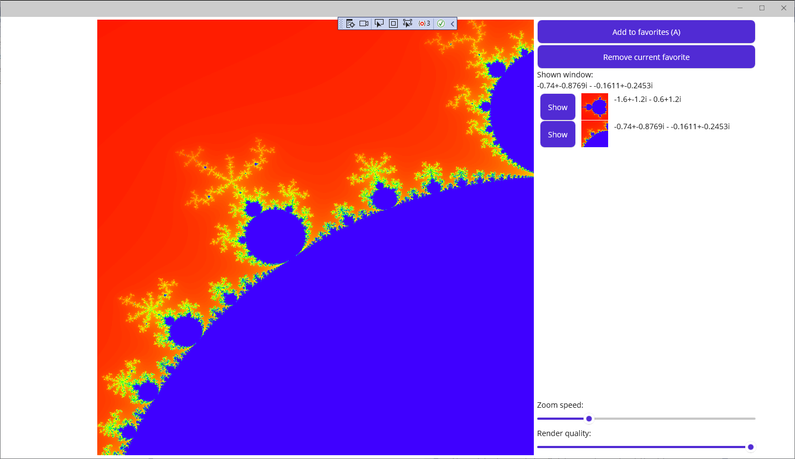

# Mandelbrot laboratórium

A laborra való felkészülést az előadáson elhangzottak segítik. A labor végére a lenti screenshothoz hasonló eredményt kell kapni.

# A konkrét laborfeladatok

(A labor elején, már most hozz létre egy új branchet és utána azon dolgozz, hogy a pull requestet könnyű legyen majd a labor végén létrehozni! És ha az egyetemen kezdted el a munkát, mielőtt elmész, ne felejtsd el felpusholni a változásokat a laborgépről a GitHubra!)

(E-mail érkezik az EViP Technologies vezetőségétől, a FavoriteMandelbrots alkalmazásunk Product Ownerétől. A megoldásnál figyelj rá, hogy ne a ShowFixedMandelbrot projektet indítsd el, hanem a FavoriteMandelbrots-ot.)

Kedves Kolléga!

Megrendelőink nagyon elégedettek a FavoriteMandelbrots alkalmazással, de találtak benne néhány apróságot, amit szeretnék, ha módosítanánk, kiegészítenénk.
Kérlek, te, mint az alkalmazás egyik fő fejlesztője, végezd el a kért módosításokat! Remélem, minden fontosat leírtak, ennél többet nem sikerült kicsikarni belőlük. :(

Üdvözlettel,
Andezit Xenon,
Product Owner

----------

Kedves Andezit Xenon,

Köszönjük a legutóbbi release-t, mindenkinek nagyon tetszett. A hétvégi demózáshoz még az alábbi módosításokat szeretnénk kérni. Remélem, nem gond...

Üdvözlettel,
Vas Mangán

## 1. feladat: Apró UI-kérések

- Ahol megjelenik az éppen megjelenített részlet koordinátája, ott a "-1.2+i-1.3" formátum nem helyes. Az "i" legyen az imaginárius tag után.
- Thumbnail megjelenítése minden kedvenchez. A felirata (koordinátái) előtt jelenjen meg egy 50x50-es kép (Image). (Mintha a fejlesztőtök azt mondta volna, hogy a view model "Thumbnail" néven már tartalmazza és csak valami Image.Source-nak kell beállítani.)

## 2. feladat: Kedvencek törlése

Nagyon jó ez a "kedvencek" funkció, csak nem lehet őket törölni. Tudnátok egy olyan nyomógombot is készíteni, ami az éppen kijelölt kedvencet törli a listáról? Ehhez egyik kollégám írt pár technikai tippet, ide másolom őket, mert én nem értem...

"Szia Mangán! Szólj nekik, hogy kellene egy MainViewerViewModel.RemoveFavoriteCommand a többi mellé. Ezeket a konstruktor példányosítja. Ja és kell hozzá egy nyomógomb a MainViewer.xaml-be, az AddButton alá."

## 3. feladat: Renderelés többféle minőségben

A renderelési folyamat elég időigényes, ezért, kérjük, rakjatok a felhasználói felületre egy csúszkát, amivel lehet módosítani, hogy mekkora legyen a renderelt kép. Úgy tudjuk, a program a renderelés előtt adja meg, hogy mekkora képet szeretne és ezt simán át lehet írni, mert ha kisebb a kép, a megjelenítés felnagyítja. (Persze ettől pixeles lesz, de az nem baj, a szép részek gyorsabb megkereséséhez elég lesz.)

## 4. feladat: Zoom sebességének állítása

A kattintással zoomolás sebességét is kérlek, tegyétek módosíthatóvá, mert most a zoom funkció mindig ugyanolyan mértékben közelít vagy távolít. A legjobb az lenne, ha erre is lenne egy csúszka, amivel lehet állítani.

Valami ilyesmit szeretnénk kapni:

